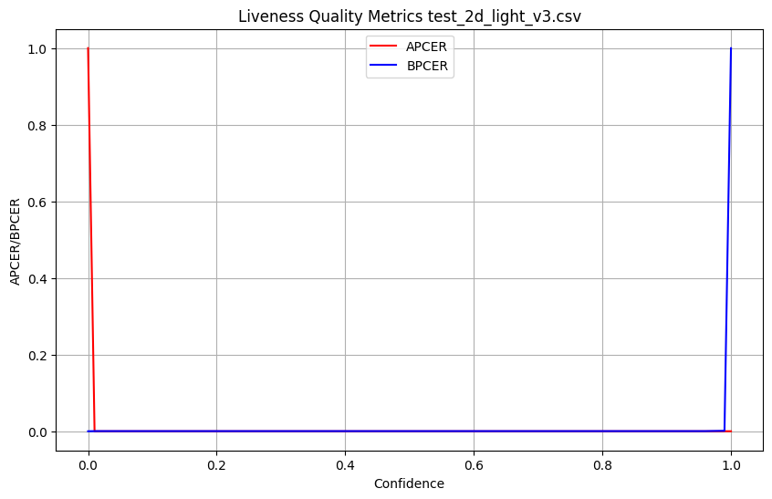
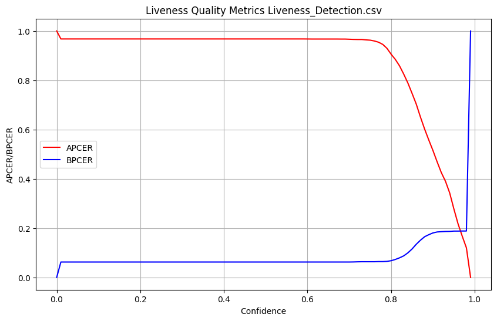

## 0) **Требования:**  
- Версия C++17.
- Версия Python 3.12.
- CMake: Версия CMake должна быть совместима с вашим проектом.

## 1) Шаги по сборке:
- Установка зависимостей [vcpkg](https://github.com/microsoft/vcpkg)
- Клонирование репозитория
```
git clone https://github.com/Rimas2200/Test_task.git
cd repository
```
- Создание сборочной директории и генерация Make-файлов
```
mkdir build
cd build
cmake ..
```
- Сборка проекта
```
cmake --build .
```
4) [Реализована на С++ программа](Test_2d_light_v3/Test_2d_light_v3.cpp), которая проводит тестирование Liveness Processing Block  (modification 2d_light, version 3). Программа сохраняет в [CSV файл](liveness_results/test_2d_light_v3.csv) ответы модуля, а также время работы модуля.

5) [Реализован на Python скрипт](liveness_results/graphic.py), который строит график APCER и BPCER в зависимости от порога по liveness_score.

<div align="center">
    
</div>
<div align="center">
    
</div>

6) [Реализован на С++ алгоритмический Liveness Detection](Liveness_Detection/Liveness_Detection.cpp), который работает быстрее чем 2d_light, version 3.
[CSV файл с результатами](liveness_results/Liveness_Detection.csv)
