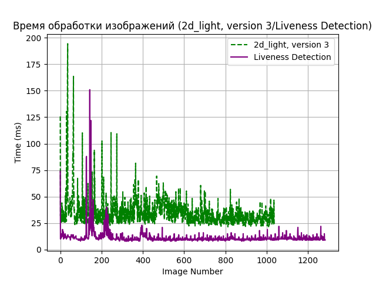

## 0) **Требования:**  
- Версия C++17.
- Версия Python 3.12.
- CMake: Версия CMake должна быть совместима с вашим проектом.

## 1) Шаги по сборке:
- Установка зависимостей [vcpkg](https://github.com/microsoft/vcpkg)
- Клонирование репозитория
```
git clone https://github.com/Rimas2200/Test_task.git
cd repository
```
- Создание сборочной директории и генерация Make-файлов
```
mkdir build
cd build
cmake ..
```
- Сборка проекта
```
cmake --build .
```
4) Реализована на С++ программа, которая проводит тестирование Liveness Processing Block  (modification 2d_light, version 3). Программа сохраняет в CSV файл ответы модуля, а также время работы модуля.
[Test Liveness Processing Block](examples/cpp/test_videocap/test_videocap.cpp)
[2d_light_version_3.csv](graphic/2d_light_version_3.csv)

5) Реализован на Python скрипт, который строит график APCER и BPCER в зависимости от порога по liveness_score, а также выводит среднее время ответа.
[graphic.py](graphic/graphic.py) 

<div align="center">
    
</div>
<div align="center">
    
</div>
<div align="center">
    
</div>

6) Реализована на С++ алгоритмический Liveness Detection, который работает быстрее чем 2d_light, version 3 и дает в районе 65-70% правильных ответов.
[liveness_results](liveness_results/Project1/FileName.cpp)

CSV файл с результатами:
[liveness_results.csv](graphic/liveness_results.csv)
